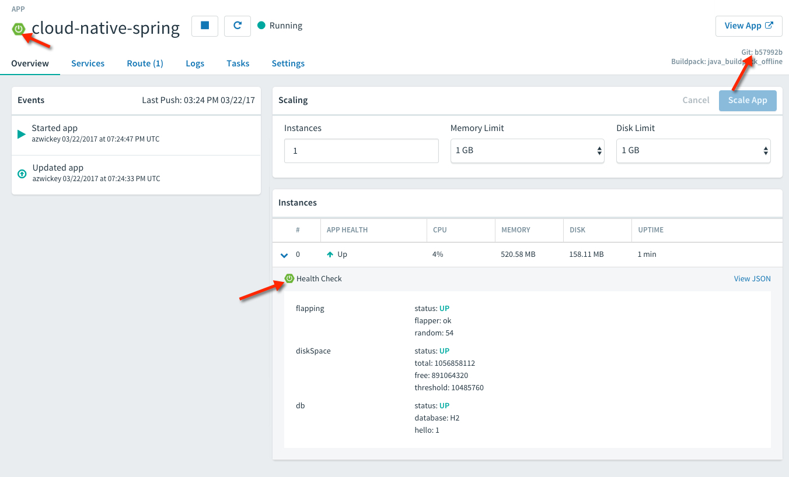
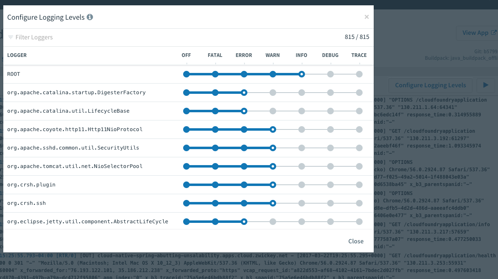

## Overview

Spring Boot includes a number of additional features to help you monitor and manage your application when it’s pushed to production. You can choose to manage and monitor your application using HTTP endpoints, with JMX or even by remote shell (SSH or Telnet). Auditing, health and metrics gathering can be automatically applied to your application.

## Set up the Actuator

Spring Boot includes a number of additional features to help you monitor and manage your application when it’s pushed to production. These features are added by adding `spring-boot-starter-actuator` to the classpath. During our initial project setup with [Spring Initializr](https://start.spring.io) we’ve already included that.

1.  Verify the Spring Boot Actuator dependency is listed in Maven `dependencies`:

    **cloud-native-spring/pom.xml.**

    ```xml
    <dependency>
      <groupId>org.springframework.boot</groupId>
      <artifactId>spring-boot-starter-actuator</artifactId>
    </dependency>
    ```

2.  By default Spring Boot will use Spring Security to protect these management endpoints (which is a good thing!) Though you wouldn’t want to disable this in production, we’ll do so in this sample app to make demonstration a bit easier and simpler.

    Add the following to your Spring Boot configuration:

    **cloud-native-spring/src/main/resources/application.yml.**

    ```yaml
    endpoints: # add this section
      sensitive: false
    ```

3.  Run the updated application:

    ```sh
    CN-Workshop/labs/my_work/cloud-native-spring $ ./mvnw spring-boot:run
    ```

    Try out the following endpoints. The output is omitted here because it can be quite large:

    | URL  | Description  |
    |---|---|
    | <http://localhost:8080/health>  | Displays Application and Datasource health information. This can be customized based on application functionality, which we’ll do later. |
    | <http://localhost:8080/beans> | Dumps all of the beans in the Spring context. |
    | <http://localhost:8080/autoconfig> | Dumps all of the auto-configuration performed as part of application bootstrapping. |
    | <http://localhost:8080/configprops> | Displays a collated list of all @ConfigurationProperties. |
    | <http://localhost:8080/env> | Dumps the application’s shell environment as well as all Java system properties. |
    | <http://localhost:8080/mappings> | Dumps all URI request mappings and the controller methods to which they are mapped. |
    | <http://localhost:8080/dump> | Performs a thread dump. |
    | <http://localhost:8080/trace> | Displays trace information (by default the last few HTTP requests). |

4.  Stop the *cloud-native-spring* application.

Include Version Control Info
============================

Spring Boot provides a [/info](http://localhost:8080/info) endpoint that
allows the exposure of arbitrary metadata. By default this information
is empty, however, we can use *actuator* to expose information about the
specific build and version control coordinates for a given deployment.

1.  The `git-commit-id-plugin` adds Git branch and commit coordinates to the [/info](http://localhost:8080/info) endpoint. Add the `git-commit-id-plugin` to Maven build plugins.

    **cloud-native-spring/pom.xml.**

    ```xml
    <project>
      [...]
      <build>
        <plugins>
          [...]
          <plugin>
            <groupId>pl.project13.maven</groupId>
            <artifactId>git-commit-id-plugin</artifactId>
            <configuration>
              <dotGitDirectory>../../../.git</dotGitDirectory>
            </configuration>
          </plugin>
          [...]
        </plugins>
      </build>
      [...]
    </project>
    ```

    **Note**
    
    The path `../../../.git` refers to the `.git` directory at the root of the lab materials repo. When using in your own project you’ll need to adjust the path to your projects `.git` folder location.

    Completed Maven configuration:

    **cloud-native-spring/pom.xml.**

    ```xml
    <?xml version="1.0" encoding="UTF-8"?>
    <project xmlns="http://maven.apache.org/POM/4.0.0" xmlns:xsi="http://www.w3.org/2001/XMLSchema-instance"
      xsi:schemaLocation="http://maven.apache.org/POM/4.0.0 http://maven.apache.org/xsd/maven-4.0.0.xsd">
      <modelVersion>4.0.0</modelVersion>

      <groupId>io.pivotal</groupId>
      <artifactId>cloud-native-spring</artifactId>
      <version>0.0.1-SNAPSHOT</version>
      <packaging>jar</packaging>

      <name>cloud-native-spring</name>
      <description>Demo project for Spring Boot</description>

      <parent>
        <groupId>org.springframework.boot</groupId>
        <artifactId>spring-boot-starter-parent</artifactId>
        <version>{spring-boot-version}.RELEASE</version>
        <relativePath/> <!-- lookup parent from repository -->
      </parent>

      <properties>
        <project.build.sourceEncoding>UTF-8</project.build.sourceEncoding>
        <java.version>1.8</java.version>
      </properties>

      <dependencies>
        <dependency>
          <groupId>org.springframework.boot</groupId>
          <artifactId>spring-boot-starter-actuator</artifactId>
        </dependency>
        <dependency>
          <groupId>org.springframework.boot</groupId>
          <artifactId>spring-boot-starter-data-jpa</artifactId>
        </dependency>
        <dependency>
          <groupId>org.springframework.boot</groupId>
          <artifactId>spring-boot-starter-data-rest</artifactId>
        </dependency>
        <dependency>
          <groupId>org.springframework.boot</groupId>
          <artifactId>spring-boot-starter-web</artifactId>
        </dependency>

        <dependency>
          <groupId>com.h2database</groupId>
          <artifactId>h2</artifactId>
          <scope>runtime</scope>
        </dependency>
        <dependency>
          <groupId>mysql</groupId>
          <artifactId>mysql-connector-java</artifactId>
          <scope>runtime</scope>
        </dependency>
        <dependency>
          <groupId>org.springframework.boot</groupId>
          <artifactId>spring-boot-starter-test</artifactId>
          <scope>test</scope>
        </dependency>
      </dependencies>

      <build>
        <plugins>
          <plugin>
            <groupId>org.springframework.boot</groupId>
            <artifactId>spring-boot-maven-plugin</artifactId>
          </plugin>
          <plugin>
            <groupId>pl.project13.maven</groupId>
            <artifactId>git-commit-id-plugin</artifactId>
            <configuration>
              <dotGitDirectory>../../../.git</dotGitDirectory>
            </configuration>
          </plugin>
        </plugins>
      </build>
    </project>
    ```

2.  Run the *cloud-native-spring* application:

    ```sh
    CN-Workshop/labs/my_work/cloud-native-spring $ ./mvnw spring-boot:run
    ```

3.  Browse to the [info](http://localhost:8080/info) endpoint. Git commit information is now included:

    ```json
    {
      "git" : {
        "commit" : {
          "time" : "2017-11-08T16:14:50.000+0000",
          "id" : "0966076"
        },
        "branch" : "master"
      }
    }
    ```

4.  Stop the *cloud-native-spring* application

    **What Just Happened?**

    By including the `git-commit-id-plugin`, details about git commit information will be included in the [/info](http://localhost:8080/info) endpoint. Git information is captured in a `git.properties` file that is generated with the build.

    For reference, review the generated file:

    **cloud-native-spring/target/classes/git.properties.**

    ```ini
    #Generated by Git-Commit-Id-Plugin
    #Wed Nov 08 10:14:59 CST 2017
    git.branch=master
    git.build.host=user.local
    git.build.time=2017-11-08T10\:14\:59-0600
    git.build.user.email=user@example.com
    ...
    ```

## Include Build Info

1.  Add the following properties to your Spring Boot configuration:

    **cloud-native-spring/src/main/resources/application.yml.**

    ```yaml
    info: # add this section
      builDd:
        artifact: @project.artifactId@
        name: @project.name@
        description: @project.description@
        version: @project.version@
    ```

    These will add the project’s Maven coordinates to the [/info](http://localhost:8080/info) endpoint. The Spring Boot Maven plugin will cause them to automatically be replaced in theassembled JAR.

    **Note**
    
    If Spring Tool Suite reports a problem with the application.yml due to @ character the problem can safely be ignored. If you *really* want to git rid of the error message, wrap the values in quotes. Example: `artifact: "@project.artifactId@"`

2.  Build and run the cloud-native-spring application:

    ```sh
    CN-Workshop/labs/my_work/cloud-native-spring $ ./mvnw spring-boot:run
    ```

3.  Browse to the [/info](http://localhost:8080/info) endpoint. Build
    information is now included:

    ```json
    {
      "build" : {
        "artifact" : "cloud-native-spring",
        "name" : "cloud-native-spring",
        "description" : "Demo project for Spring Boot",
        "version" : "0.0.1-SNAPSHOT"
      },
      "git" : {
        "commit" : {
          "time" : "2017-11-08T16:14:50.000+0000",
          "id" : "0966076"
        },
        "branch" : "master"
      }
    }
    ```

4.  Stop the *cloud-native-spring* application.

    **What Just Happened?**

    We have mapped Maven properties from the `pom.xml` into the [/info](http://localhost:8080/info) endpoint.

    Read more about exposing data in the [/info](http://localhost:8080/info) endpoint [here](http://docs.spring.io/spring-boot/docs/current/reference/htmlsingle/#production-ready)

## Health Indicators

Spring Boot provides a [/health](http://localhost:8080/health) endpoint that exposes various health indicators that describe the health of the given application. Normally, when Spring Security is not enabled, the [/health](http://localhost:8080/health) endpoint will only expose an UP or DOWN value.

```json
{
  "status": "UP"
}
```

1.  To simplify working with the endpoint for this lab, we will turn off
    additional security for the health endpoint.

    Add the following to your Spring Boot configuration:

    **cloud-native-spring/src/main/resources/application.yml.**

    ```yaml
    management: # add this section
      security:
        enabled: false
    ```

2.  Build and run the *cloud-native-spring* application:

    ```sh
    CN-Workshop/labs/my_work/cloud-native-spring $ ./mvnw spring-boot:run
    ```

3.  Browse to the [/health](http://localhost:8080/health) endpoint. Out of the box is a `DiskSpaceHealthIndicator` that monitors health in terms of available disk space. Would your Ops team like to know if the app is close to running out of disk space? `DiskSpaceHealthIndicator` can be customized via `DiskSpaceHealthIndicatorProperties`. For instance, setting a different threshold for when to report the status as DOWN.

    ```json
    {
      "status" : "UP",
      "diskSpace" : {
        "status" : "UP",
        "total" : 499283816448,
        "free" : 133883150336,
        "threshold" : 10485760
      },
      "db" : {
        "status" : "UP",
        "database" : "H2",
        "hello" : 1
      }
    }
    ```

4.  Stop the *cloud-native-spring* application.

5.  Let’s create a custom health indicator that will randomize the health check. Create the class `io.pivotal.cloudnativespring.FlappingHealthIndicator` and into it paste the following code:

    **cloud-native-spring/src/main/java/io/pivotal/cloudnativespring/FlappingHealthIndicator.java.**

    ```java
    package io.pivotal.cloudnativespring;

    import java.util.Random;

    import org.springframework.boot.actuate.health.Health;
    import org.springframework.boot.actuate.health.HealthIndicator;
    import org.springframework.stereotype.Component;

    @Component
    public class FlappingHealthIndicator implements HealthIndicator {

        private Random random = new Random(System.currentTimeMillis());

        @Override
        public Health health() {
            int result = random.nextInt(100);
            if (result < 50) {
                return Health.down().withDetail("flapper", "failure").withDetail("random", result).build();
            } else {
                return Health.up().withDetail("flapper", "ok").withDetail("random", result).build();
            }
        }
    }
    ```

6.  Build and run the *cloud-native-spring* application:

    ```sh
    CN-Workshop/labs/my_work/cloud-native-spring $ ./mvnw spring-boot:run
    ```

7.  Browse to the [/health](http://localhost:8080/health) endpoint and verify that the output is similar to the following (and changes randomly!).

    ```json
    {
      "status" : "DOWN",
      "flapping" : {
        "status" : "DOWN",
        "flapper" : "failure",
        "random" : 48
      },
      "diskSpace" : {
        "status" : "UP",
        "total" : 499283816448,
        "free" : 133891973120,
        "threshold" : 10485760
      },
      "db" : {
        "status" : "UP",
        "database" : "H2",
        "hello" : 1
      }
    }
    ```

## Metrics

Spring Boot provides a [/metrics](http://localhost:8080/metrics) endpoint that exposes several automatically collected metrics for your application. It also allows for the creation of custom metrics.

1.  Browse to the [/metrics](http://localhost:8080/metrics) endpoint. Review the metrics exposed:

    ```json
    {
      "mem" : 867005,
      "mem.free" : 337836,
      "processors" : 8,
      "instance.uptime" : 212096,
      "uptime" : 220870,
      "systemload.average" : 2.97265625,
      "heap.committed" : 762368,
      "heap.init" : 262144,
      "heap.used" : 424531,
      "heap" : 3728384,
      "nonheap.committed" : 107584,
      "nonheap.init" : 2496,
      "nonheap.used" : 104638,
      "nonheap" : 0,
      "threads.peak" : 27,
      "threads.daemon" : 21,
      "threads.totalStarted" : 32,
      "threads" : 23,
      "classes" : 13753,
      "classes.loaded" : 13753,
      "classes.unloaded" : 0,
      "gc.ps_scavenge.count" : 8,
      "gc.ps_scavenge.time" : 148,
      "gc.ps_marksweep.count" : 3,
      "gc.ps_marksweep.time" : 433,
      "httpsessions.max" : -1,
      "httpsessions.active" : 0,
      "datasource.primary.active" : 0,
      "datasource.primary.usage" : 0.0,
      "gauge.response.health" : 2.0,
      "gauge.response.star-star.favicon.ico" : 1.0,
      "counter.status.200.star-star.favicon.ico" : 21,
      "counter.status.200.health" : 12,
      "counter.status.503.health" : 10
    }
    ```

2.  Stop the *cloud-native-spring* application.

# Deploy *cloud-native-spring* to Pivotal Cloud Foundry

1.  Build the application:

    ```sh
    CN-Workshop/labs/my_work/cloud-native-spring $ ./mvnw package
    ```

2.  When running a Spring Boot application on Pivotal Cloud Foundry with the actuator endpoints enabled, you can visualize actuator management information on the Apps Manager dashboard. To enable this there are a few properties we need to add.

    Add the following to your Spring Boot configuration:

    **cloud-native-spring/src/main/resources/application.yml.**

    ```yaml
    management:
      security:
        enabled: false
      info:
        git:
          mode: full
      cloudfoundry:
        enabled: true
        skip-ssl-validation: false # set to true if using an insecure CF environment
    ```

3.  In order to add full build information to your artifact that is pushed to Cloud Foundry, and add the following execution and classifier to the `spring-boot-maven-plugin`:

    **cloud-native-spring/pom.xml.**
    ```xml
    <executions>
      <execution>
        <goals>
          <goal>build-info</goal>
        </goals>
      </execution>
    </executions>
    <configuration>
      <classifier>exec</classifier>
    </configuration>
    ```

    The full plugin config should look like the following:

    **cloud-native-spring/pom.xml.**

    ```xml
    <project>
      [...]
      <build>
        <plugins>
          [...]
          <plugin>
            <groupId>org.springframework.boot</groupId>
            <artifactId>spring-boot-maven-plugin</artifactId>
            <executions>
              <execution>
                <goals>
                  <goal>build-info</goal>
                </goals>
              </execution>
            </executions>
            <configuration>
              <classifier>exec</classifier>
            </configuration>
          </plugin>
          [...]
        </plugins>
      </build>
      [...]
    </project>
    ```

4.  By specifying a classifier we actually just produced 2 jars, one that is executable and one that can be used as an artifact that could be included in other apps (such as our Client UI app we’ll create later). Because of this we need to chance the name of the jar we included in our manifest.yml file.

    Change the Cloud Foundry manifest path property to:

    **cloud-native-spring/manifest.yml.**

    ```yaml
    ---
    applications:
    - name: cloud-native-spring
      random-route: true
      memory: 768M
      path: target/cloud-native-spring-0.0.1-SNAPSHOT-exec.jar # <-- update jar name
      timeout: 180
      env:
        JAVA_OPTS: -Djava.security.egd=file:///dev/urandom
    ```

5.  Rebuild the application

    ```sh
    CN-Workshop/labs/my_work/cloud-native-spring $ ./mvnw package
    ```

6.  Push application into Cloud Foundry

    ```sh
    CN-Workshop/labs/my_work/cloud-native-spring $ cf push
    ```

7.  Find the URL created for your app in the health status report and browse to your app. Also view your application details in the Apps Manager UI:

    

8.  From this UI you can also dynamically change logging levels:

    

**Congratulations!** You’ve just learned how to add health and metrics to any Spring Boot application.
