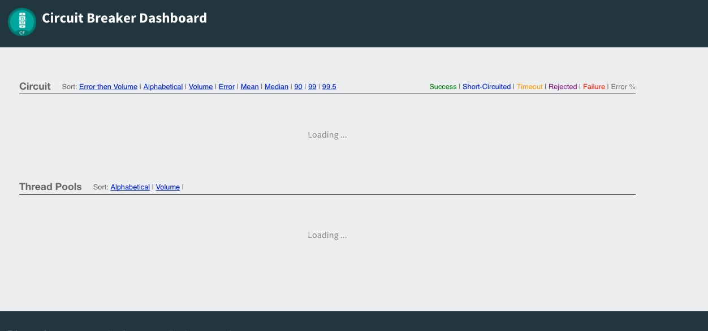
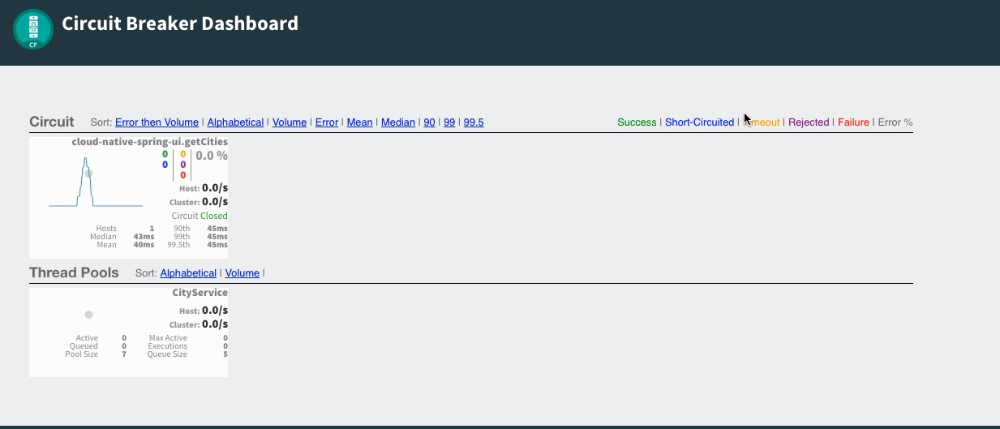

Overview
========

In this lab we’ll utilize Spring Boot and Spring Cloud to make our UI
Application more resilient. We’ll leverage Spring Cloud Circuit Breaker
to configure our application behavior when our downstream dependencies
are not available. Finally, we’ll use the circuit breaker dashboard to
view metrics of the circuit breaker we implemented, which will be
auto-provisioned within Pivotal Cloud Foundry Spring Cloud Services.

Define a Circuit Breaker within the *UI Application*
====================================================

1.  These features are added by adding
    `spring-cloud-services-starter-circuit-breaker` to Maven project
    dependencies:

    **cloud-native-spring-ui/pom.xml.**

    ```xml
    <dependency>
        <groupId>io.pivotal.spring.cloud</groupId>
        <artifactId>spring-cloud-services-starter-circuit-breaker</artifactId>
    </dependency>
    ```

2.  The first thing we need to add to our application is an
    `@EnableCircuitBreaker` annotation to the Spring Boot application.
    Add this annotation to the `CloudNativeSpringUIApplication` class:

    **cloud-native-spring-ui/src/main/java/io/pivotal/cloudnativespringui/CloudNativeSpringUiApplication.java.**

    ```java
    @SpringBootApplication
    @EnableFeignClients
    @EnableDiscoveryClient
    @EnableCircuitBreaker // <---- Add this
    public class CloudNativeSpringUiApplication {
        [...]
    }
    ```

3.  When we introduced the `@FeignClient` into our application we were
    only required to provide an interface. We’ll provide a dummy class
    that implements that interface for our fallback. We’ll also
    reference that class as a fallback in our `@FeignClient` annotation.
    First, create this inner class in the
    `CloudNativeSpringUiApplication` class:

    **cloud-native-spring-ui/src/main/java/io/pivotal/cloudnativespringui/CloudNativeSpringUiApplication.java.**

    ```
    @Component
    public class CityClientFallback implements CityClient {
        @Override
        public Resources<City> getCities() {
            // We'll just return an empty response
            return new Resources<City>(Collections.emptyList());
        }
    }
    ```

4.  Also modify the `@FeignClient` annotation to reference this class as
    the fallback in case of failure:

    **cloud-native-spring-ui/src/main/java/io/pivotal/cloudnativespringui/CloudNativeSpringUiApplication.java.**

    ```
    @FeignClient(name = "cloud-native-spring", fallback = CityClientFallback.class)
    public interface CityClient {
        [...]
    }
    ```

5.  Your Boot Application should now look like this
    *CloudNativeSpringUiApplication*:

    **cloud-native-spring-ui/src/main/java/io/pivotal/cloudnativespringui/CloudNativeSpringUiApplication.java.**

    ```
    package io.pivotal.cloudnativespringui;

    import java.util.Collections;

    import org.springframework.boot.SpringApplication;
    import org.springframework.boot.autoconfigure.SpringBootApplication;
    import org.springframework.cloud.client.circuitbreaker.EnableCircuitBreaker;
    import org.springframework.cloud.client.discovery.EnableDiscoveryClient;
    import org.springframework.cloud.netflix.feign.EnableFeignClients;
    import org.springframework.cloud.netflix.feign.FeignClient;
    import org.springframework.hateoas.Resources;
    import org.springframework.stereotype.Component;
    import org.springframework.web.bind.annotation.GetMapping;

    import io.pivotal.cloudnativespring.domain.City;

    @SpringBootApplication
    @EnableFeignClients
    @EnableDiscoveryClient
    @EnableCircuitBreaker
    public class CloudNativeSpringUiApplication {

        public static void main(String[] args) {
            SpringApplication.run(CloudNativeSpringUiApplication.class, args);
        }

        @FeignClient(name = "cloud-native-spring", fallback = CityClientFallback.class)
        public interface CityClient {
            @GetMapping(value = "/cities", consumes = "application/hal+json")
            Resources<City> getCities();
        }

        @Component
        public class CityClientFallback implements CityClient {
            @Override
            public Resources<City> getCities() {
                // We'll just return an empty response
                return new Resources<City>(Collections.emptyList());
            }
        }
    }
    ```

6.  To enable Feign Hystrix support, we’ll need to add the following to
    our Spring Boot configuration:

    **cloud-native-spring-ui/src/main/resources/application.yml.**

    ```yaml
    feign:
        hystrix:
        enabled: true
    ```

    Completed:

    **cloud-native-spring-ui/src/main/resources/application.yml.**

    ```yaml
    spring:
        application:
        name: cloud-native-spring-ui

    feign:
        hystrix:
        enabled: true

    security:
        basic:
        enabled: false
    ```

Create the Circuit Breaker Dashboard
====================================

1.  When we modified our application to use a Hystrix Circuit Breaker
    our application automatically begins streaming out metrics about the
    health of our methods wrapped with a HystrixCommand. We can stream
    these events through a AMQP message bus into Turbine to view on a
    Circuit Breaker dashboard. This can be done through Cloud Foundry
    using the services marketplace by executing the following command:

    ```sh
    CN-Workshop/labs/my_work/cloud-native-spring-ui $ cf create-service p-circuit-breaker-dashboard standard circuit-breaker-dashboard
    ```

2.  If we view the Circuit Breaker Dashboard (accessible from the
    **Manage** link in Apps Manager) you will see that a dashboard has
    been deployed but is empty (You may get an *initializing* message
    for a few seconds. This should eventually refresh to a dashboard):

    

3.  We will now bind our application to our `circuit-breaker-dashboard`
    within our Cloud Foundry deployment manifest:

    **cloud-native-spring-ui/manifest.yml.**

    ```yaml
    services:
    - service-registry
    - circuit-breaker-dashboard # <---- Add this
    ```

Deploy and test application
===========================

1.  Build the application

    ```sh
    CN-Workshop/labs/my_work/cloud-native-spring-ui $ ./mvnw package
    ```

2.  Push application to Cloud Foundry

    ```sh
    CN-Workshop/labs/my_work/cloud-native-spring-ui $ cf push
    ```

3.  Test your application by navigating to the root URL of
    the application. If the dependent cities REST service is still
    stopped, you should simply see a blank table. Remember that last
    time you received a nasty exception in the browser? Now your Circuit
    Breaker fallback method is automatically called and the fallback
    behavior is executed.

    

4.  From a commandline start the cloud-native-spring microservice (the
    original city service, not the new UI)

    ```sh
    CN-Workshop/labs/my_work/cloud-native-spring $ cf start cloud-native-spring
    ```

5.  Refresh the UI app and you should once again see a table listing the
    first page of cities.

    

6.  Refresh your UI application a few times to force some traffic though
    the circuit breaker call path. After doing this you should now see
    the dashboard populated with metrics about the health of your
    Hystrix circuit breaker:

    


