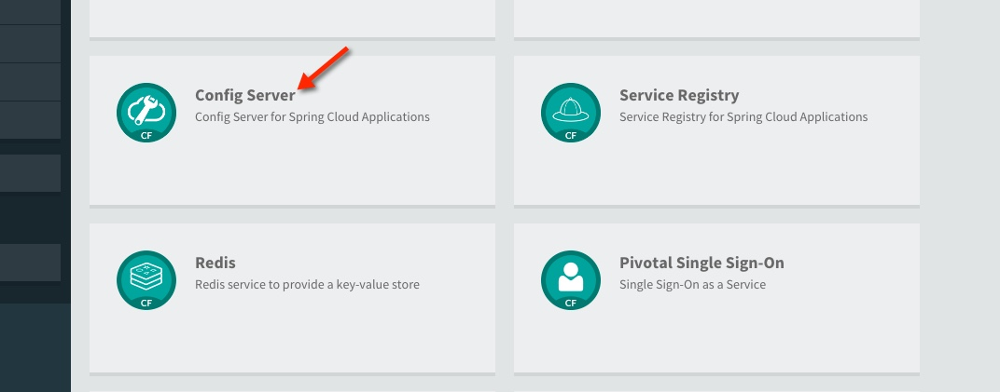
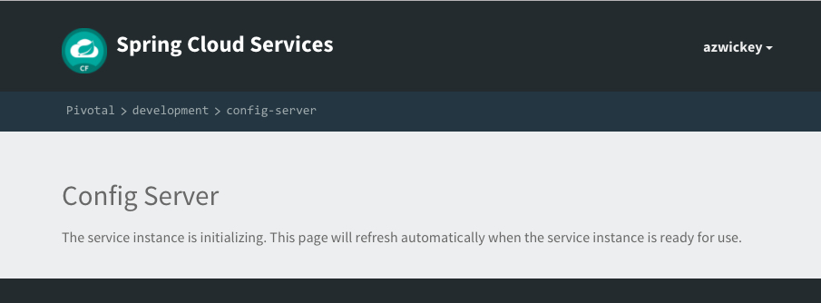

# Overview

In this lab we’ll utilize Spring Boot and Spring Cloud to configure our application from a configuration dynamically retrieved from a git repository. We’ll then deploy it to Pivotal Cloud Foundry and auto-provision an instance of a configuration server using Pivotal Spring Cloud Services.

# Update *Hello* REST service

1.  These features are added by adding
    `spring-cloud-services-starter-config-client` to the classpath.

    Add the following to Maven `dependencies`:

    **cloud-native-spring/pom.xml.**

    ```xml
    <project>
        [...]
        <dependencies>
        [...]
        <dependency>
            <groupId>io.pivotal.spring.cloud</groupId>
            <artifactId>spring-cloud-services-starter-config-client</artifactId>
        </dependency>
        [...]
        </dependencies>
        [...]
    </project>
    ```

2.  Because Pivotal keeps the open source dependancies separate from the PCF specific ones, we need to add two entries for Spring Cloud and Pivotal Cloud dependency management. Add this snippet to your Maven project:

    **cloud-native-spring/pom.xml.**

    ```xml
    <project>
        [...]
        <dependencies>
            [...]
        </dependencies>
        [...]
        <dependencyManagement>
          <dependencies>
            <dependency>
              <groupId>io.pivotal.spring.cloud</groupId>
              <artifactId>spring-cloud-services-dependencies</artifactId>
              <version>{spring-cloud-services-dependencies-version}</version>
              <type>pom</type>
              <scope>import</scope>
            </dependency>
            <dependency>
              <groupId>org.springframework.cloud</groupId>
              <artifactId>spring-cloud-dependencies</artifactId>
              <version>{spring-cloud-dependencies-version}</version>
              <type>pom</type>
              <scope>import</scope>
            </dependency>
          </dependencies>
        </dependencyManagement>
        [...]
    </project>
    ```

3.  Add an `@Value` annotation, private field, and associated usage to the `CloudNativeSpringApplication` class.

    **cloud-native-spring/src/main/java/io/pivotal/CloudNativeSpringApplication.java.**

    ```java
    @Value("${greeting:Hola}")
    private String greeting;

    @RequestMapping("/")
    public String hello() {
        return greeting + " World!";
    }
    ```

    Completed:

    **cloud-native-spring/src/main/java/io/pivotal/CloudNativeSpringApplication.java.**

    ```java
    package io.pivotal.cloudnativespring;

    import org.springframework.beans.factory.annotation.Value;
    import org.springframework.boot.SpringApplication;
    import org.springframework.boot.autoconfigure.SpringBootApplication;
    import org.springframework.context.annotation.Import;
    import org.springframework.data.jpa.repository.config.EnableJpaRepositories;
    import org.springframework.data.rest.webmvc.config.RepositoryRestMvcConfiguration;
    import org.springframework.web.bind.annotation.RequestMapping;
    import org.springframework.web.bind.annotation.RestController;

    @SpringBootApplication
    @RestController
    @EnableJpaRepositories
    @Import(RepositoryRestMvcConfiguration.class)
    public class CloudNativeSpringApplication {

        @Value("${greeting:Hola}")
        private String greeting;

        public static void main(String[] args) {
            SpringApplication.run(CloudNativeSpringApplication.class, args);
        }

        @RequestMapping("/")
        public String hello() {
            return greeting + " World!";
        }
    }
    ```

4.  When we introduced the Spring Cloud Services Starter Config Client dependency Spring Security will also be included (Config servers will be protected by OAuth2). However, this will also enable basic authentication to all our service endpoints.

    Add the following to your Spring Boot configuration:

    **cloud-native-spring/src/main/resources/application.yml.**

    ```yaml
    security:
      basic:
        enabled: false
    ```

5.  We’ll also want to give our Spring Boot application a name so that it can lookup application-specific configuration from the config server later.

    Add the following to your Spring Boot configuration:

    **cloud-native-spring/src/main/resources/application.yml.**

    ```yaml
    spring:
      application:
        name: cloud-native-spring
    ```

6.  Complete YML:

    ```yaml
    spring:
      application:
        name: cloud-native-spring
        
    endpoints:
      sensitive: false

    management:
      security:
        enabled: false
      cloudfoundry:
        enabled: true
        skip-ssl-validation: true # set to false if using an secure CF environment

    security:
      basic:
        enabled: false
    ```

7.  Run the *cloud-native-spring* Application and verify dynamic config is working:

    ```sh
    CN-Workshop/labs/my_work/cloud-native-spring $ ./mvnw spring-boot:run
    ```

8.  Browse to <http://localhost:8080> and verify you now see your new default greeting:

    **Hola World!**

9.  Stop the *cloud-native-spring* application

# Create Spring Cloud Config Server instance

1.  Now that our application is ready to read its config from a cloud config server, we need to deploy one! This can be done through Cloud Foundry using the services marketplace. Browse to the marketplace in Pivotal Cloud Foundry Apps Manager, navigate to the space you have been using to push your app, and select Config Server:

    

2.  In the resulting details page, select the *standard*, single tenant plan. Name the instance `config-server`, select the space that you’ve been using to push all your applications. At this time you don’t need to select a application to bind to the service:

    

3.  After we create the service instance you’ll be redirected to your *Space* landing page that lists your apps and services. The config server is deployed on-demand and will take a few moments to deploy. Once the message *Creating service instance…* disappears, click on the service you provisioned. Select the **Manage** link towards the top of the resulting screen. This view shows the instance id and a JSON document showing the current configuration. The `count` element shows how many instances of Config Server we have provisioned:

    

4.  We now need to update the service instance with our GIT repository information where our configuration files are stored. For this example, we are using the `config` branch of our workshop repository.

    Using the Cloud Foundry CLI execute the following update service command:

    ```sh
    CN-Workshop/labs/my_work/cloud-native-spring $ cf update-service config-server -c '{"git": { "uri": "https://github.com/Pivotal-Field-Engineering/CN-Workshop", "label": "config" } }'
    ```

5.  Refresh you Config Server management page and you will see the following message. Wait until the screen refreshes and the service is reintialized:

    

6.  We will now bind our application to our `config-server`. Add these entries to our Cloud Foundry manifest:

    **cloud-native-spring/manifest.yml.**

    ```yaml
    services:
    - config-server
    ```

    Complete:

    ```yaml
    ---
    applications:
    - name: cloud-native-spring
      random-route: true
      memory: 768M
      path: target/cloud-native-spring-0.0.1-SNAPSHOT-exec.jar
      timeout: 180
      env:
        JAVA_OPTS: -Djava.security.egd=file:///dev/urandom
      services:
      - config-server
    ```

## Deploy and test application

1.  Build the application

    ```sh
    CN-Workshop/labs/my_work/cloud-native-spring $ ./mvnw clean package
    ```

2.  Push application into Cloud Foundry

    ```sh
    CN-Workshop/labs/my_work/cloud-native-spring $ cf push
    ```

3.  Test your application by navigating to the root URL of the application, which will invoke the hello() service. You should now see a greeting that is read from the cloud config server!

    **Bonjour World!**

4.  What just happened?? A Spring component within the Spring Cloud Starter Config Client module called a *service connector* automatically detected that there was a Cloud Config service bound into the application. The service connector configured the application automatically to connect to the cloud `config-server` and download the configuration and wire it into the application

5.  If you navigate to the GIT repo we specified for our configuration, <https://github.com/Pivotal-Field-Engineering/CN-Workshop/tree/config>, you’ll see a file named `cloud-native-spring.yml`. This filename is the same as our `spring.application.name` value for our Spring Boot application. The configuration is read from this file, in our case the following property:

    ```
    greeting: Bonjour
    ```

6.  Next we’ll learn how to register our service with a Service Registry and load balance requests using Spring Cloud components.
